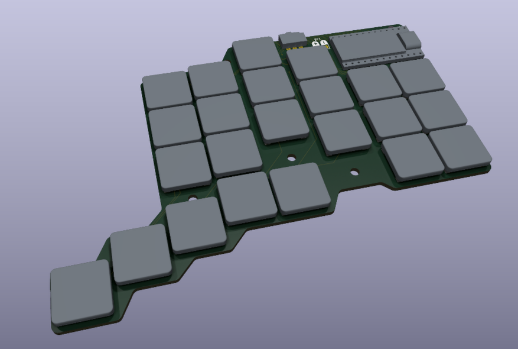
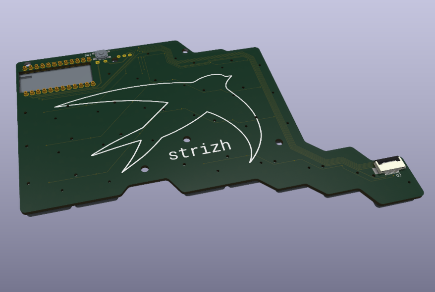

# [WIP] Strizh keyboard

**Strizh** (Russian for "swift") is an ultra low profile 44-48 key split with Kailh PG1316S switches

## Planned features

- ~9 mm thickness

- ZMK firmware

- NRF52840 SuperMini controllers

- optional 40 mm Cirque trackpad

- optional nice!view display

## PCB Draft

 
